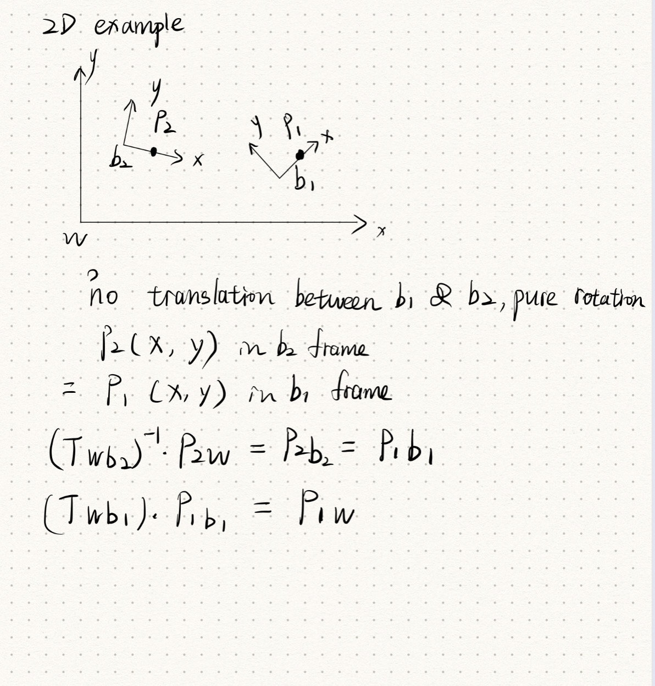

Pointcloud Data Processing

Here's a picture explaning how to transform the newly accepted pointcloud data

to the preivous pointcloud frame.

Using ICP can help us to better find the transformation between two frames. However, ICP requires a rough initial pose guess, and they cannot find enough correspondence for the filtered point cloud.So the ICP estimated transformation is the same as the initial guess, which is calculated through the ways mentioned above.  Also , we need to accumulate the pose to transform all the pointcloud back to align with first image.